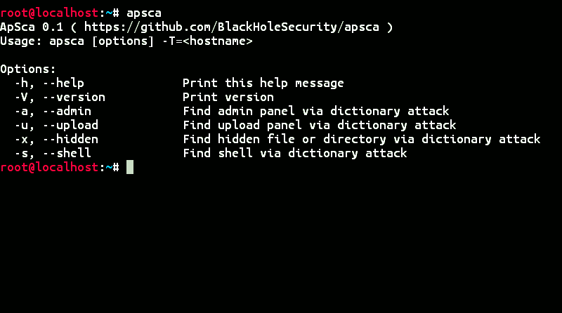

# ApSca
ApSca is a powerful web penetration application which finds admin panel, upload panel, shell, hidden file, hidden page and other sensitive information via dictionary attack, the best CLI tool for finding vulnerability on a website and it performs specific checks.

## Screenshot


## Installation
```
apt-get install git
git clone https://github.com/BlackHoleSecurity/apsca
```

## Usage
```
bash apsca.sh
```